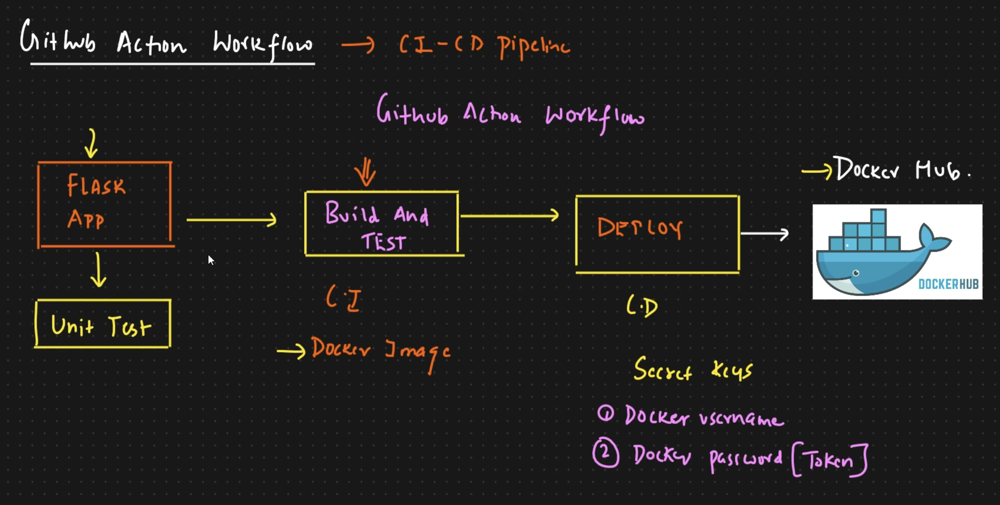
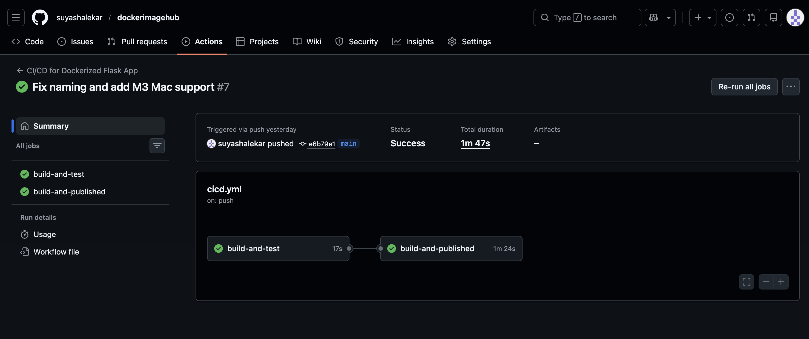
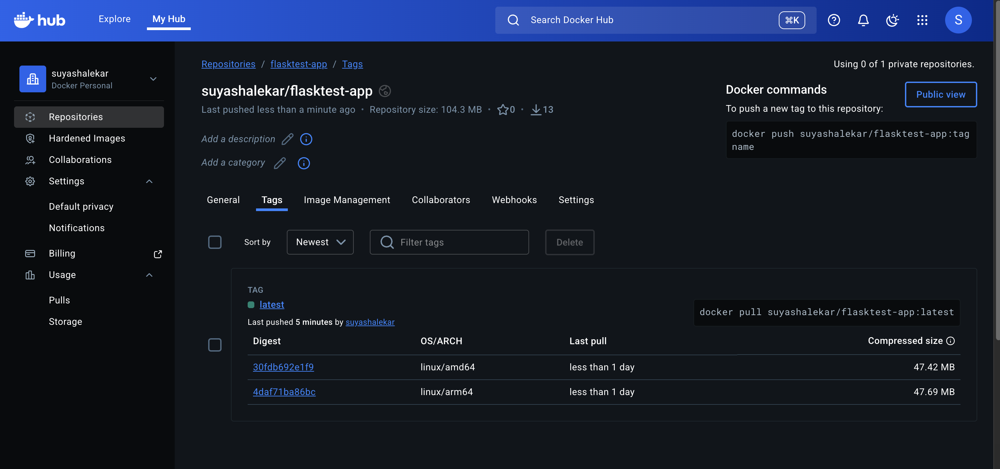

# CI/CD for Dockerized Flask Application 🚀

This project demonstrates a full-stack **CI/CD (Continuous Integration/Continuous Deployment)** pipeline. It automates the testing, building, and deployment of a containerized Python Flask application.

## 🏗️ System Architecture & Workflow



I designed this workflow to ensure that every code change is automatically verified before being deployed to a production-ready registry.

### Workflow Breakdown:

1. **Continuous Integration (CI)**: Whenever code is pushed to the `main` branch, GitHub Actions triggers the `build-and-test` job.
* **Environment**: Runs on a fresh **Ubuntu** virtual machine.
* **Validation**: It installs dependencies (Flask, Pytest) and runs automated unit tests to ensure code integrity.



2. **Continuous Deployment (CD)**: If and only if the tests pass (`needs: build-and-test`), the pipeline proceeds to the `build-and-published` stage.
* **Security**: Uses **GitHub Secrets** to securely handle Docker Hub credentials without exposing them in the code.
* **Multi-Platform Support**: To support modern development environments (like **MacBook M3/ARM64**) and standard cloud servers (AMD64), I configured the pipeline to build for multiple architectures simultaneously.



---

## 🐳 Docker Hub Deployment

The final stage of the pipeline pushes the container image to **Docker Hub**. As shown below, the image is tagged as `latest` and includes manifests for both **linux/amd64** and **linux/arm64**.

### How to Run the Production Image:

Because of the multi-platform build, this image can be pulled and run on any machine (Intel, AMD, or Apple Silicon) with a single command:

```bash
docker run -p 5000:5000 suyashalekar/flasktest-app:latest

```

---

## 🛠️ Technical Stack

* **Language**: Python 3.9
* **Web Framework**: Flask
* **Testing**: Pytest
* **Containerization**: Docker
* **Orchestration/Automation**: GitHub Actions (CI/CD)
* **Infrastructure**: QEMU & Docker Buildx for cross-platform builds